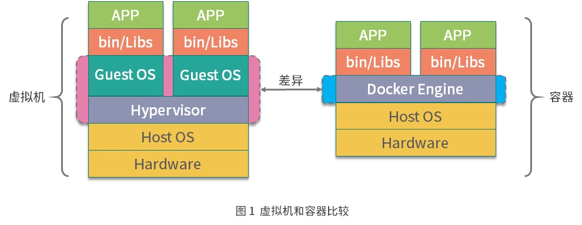

# 容器安全

## 相关链接

[Docker Hub 全球最大的镜像市场](https://hub.docker.com/)

## 虚拟机与容器的实现区别

  

虚拟机是通过管理系统(Hypervisor)模拟出 CPU、内存、网络等硬件，然后在这些模拟的硬件上创建客户内核和操作系统。这样做的好处就是虚拟机有自己的内核和操作系统，并且硬件都是通过虚拟机管理系统模拟出来的，用户程序无法直接使用到主机的操作系统和硬件资源，因此虚拟机也对隔离性和安全性有着更好的保证。

Docker 容器则是通过 Linux 内核的 Namespace 技术实现了文件系统、进程、设备以及网络的隔离，然后再通过 Cgroups 对 CPU、 内存等资源进行限制，最终实现了容器之间相互不受影响，由于容器的隔离性仅仅依靠内核来提供，因此容器的隔离性也远弱于虚拟机。

虽然虚拟机安全性这么好，但容器的性能损耗非常小，镜像也小，而且在业务快速开发和迭代的今天，容器秒级的启动等特性也非常匹配业务快速迭代的业务场景。因此我们只要保证容器足够安全就行。

## 容器安全重点

1. 镜像安全
    > 由于 Docker 容器是基于镜像创建并启动，因此镜像的安全直接影响到容器的安全。具体影响镜像安全的总结如下。  
    1. 镜像软件存在安全漏洞：由于容器需要安装基础的软件包，如果软件包存在漏洞，则可能会被不法分子利用并且侵入容器，影响其他容器或主机安全。  
    2. 仓库漏洞：无论是 Docker 官方的镜像仓库还是我们私有的镜像仓库，都有可能被攻击，然后篡改镜像，当我们使用镜像时，就可能成为攻击者的目标对象。
    3. 用户程序漏洞：用户自己构建的软件包可能存在漏洞或者被植入恶意脚本，这样会导致运行时提权影响其他容器或主机安全
2. Linux 内核隔离性不够
    > 尽管目前 Namespace 已经提供了非常多的资源隔离类型，但是仍有部分关键内容没有被完全隔离，其中包括一些系统的关键性目录（如 /sys、/proc 等），这些关键性的目录可能会泄露主机上一些关键性的信息，让攻击者利用这些信息对整个主机甚至云计算中心发起攻击。而且仅仅依靠 Namespace 的隔离是远远不够的，因为一旦内核的 Namespace 被突破，使用者就有可能直接提权获取到主机的超级权限，从而影响主机安全。
3. 所有容器共享主机内核
    > 由于同一宿主机上所有容器共享主机内核，所以攻击者可以利用一些特殊手段导致内核崩溃，进而导致主机上所有容器崩溃

## 容器安全措施

1. 及时升级 Docker 自身安全性改进
    > Docker 从 2013 年诞生到现在，在安全性上面已经做了非常多的努力。
    Docker 自身是基于 Linux 的多种 Namespace 实现的，其中有一个很重要的 Namespace 叫作 User Namespace，User Namespace 主要是用来做容器内用户和主机的用户隔离的。在过去容器里的 root 用户就是主机上的 root 用户，如果容器受到攻击，或者容器本身含有恶意程序，在容器内就可以直接获取到主机 root 权限。Docker 从 1.10 版本开始，使用 User Namespace 做用户隔离，实现了容器中的 root 用户映射到主机上的非 root 用户，从而大大减轻了容器被突破的风险
2. 保障镜像安全
    > 为保障镜像安全，我们可以在私有镜像仓库安装镜像安全扫描组件，对上传的镜像进行检查，通过与 CVE 数据库对比，一旦发现有漏洞的镜像及时通知用户或阻止非安全镜像继续构建和分发。同时为了确保我们使用的镜像足够安全，在拉取镜像时，要确保只从受信任的镜像仓库拉取，并且与镜像仓库通信一定要使用 HTTPS 协议。
3. 加强内核安全和管理
    > 由于安全性强依赖于内核，因此我们对于内核的安全应该更加重视。可以从以下几个方面进行加强：
    1. 宿主机内核应该尽量安装最新补丁，因为更新的内核补丁往往有着更好的安全性和稳定性
    2. Capabilities 是 Linux 内核的概念，Linux 将系统权限分为了多个 Capabilities，它们都可以单独地开启或关闭，Capabilities 实现了系统更细粒度的访问控制
    3. 在执行docker run命令启动容器时，如非特殊可控情况，--privileged 参数不允许设置为 true，其他特殊权限可以使用 --cap-add 参数，根据使用场景适当添加相应的权限
    4. Linux 的 SELinux、AppArmor、GRSecurity 组件都是 Docker 官方推荐的安全加固组件
       1. SELinux (Secure Enhanced Linux): 是 Linux 的一个内核安全模块，提供了安全访问的策略机制，通过设置 SELinux 策略可以实现某些进程允许访问某些文件
       2. AppArmor: 类似于 SELinux，也是一个 Linux 的内核安全模块，普通的访问控制仅能控制到用户的访问权限，而 AppArmor 可以控制到用户程序的访问权限
       3. GRSecurity: 是一个对内核的安全扩展，可通过智能访问控制，提供内存破坏防御，文件系统增强等多种防御形式
    5. 在生产环境中，建议每个容器都添加相应的资源限制。限制 CPU、内存、PID（--pids-limit）等资源。
