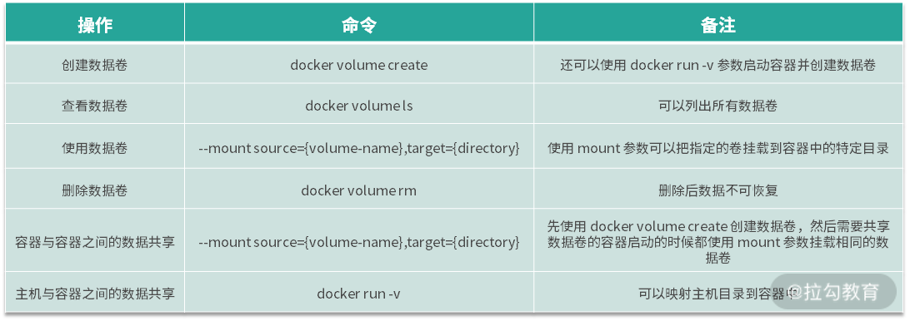

# 容器数据卷

## 卷的作用

容器按照业务类型，总体可以分为两类：
1. 无状态的（数据不需要被持久化）
2. 有状态的（数据需要被持久化）

显然，容器更擅长无状态应用。因为未持久化数据的容器根目录的生命周期与容器的生命周期一样，容器文件系统的本质是在镜像层上面创建的读写层，运行中的容器对任何文件的修改都存在于该读写层，当容器被删除时，容器中的读写层也会随之消失。

虽然容器希望所有的业务都尽量保持无状态，这样容器就可以开箱即用，并且可以任意调度，但实际业务总是有各种需要数据持久化的场景，比如 MySQL、Kafka 等有状态的业务。因此为了解决有状态业务的需求，Docker 提出了卷（Volume）的概念。

什么是卷？卷的本质是文件或者目录，它可以绕过默认的联合文件系统，直接以文件或目录的形式存在于宿主机上。卷的概念不仅解决了数据持久化的问题，还解决了容器间共享数据的问题。使用卷可以将容器内的目录或文件持久化，当容器重启后保证数据不丢失，例如我们可以使用卷将 MySQL 的目录持久化，实现容器重启数据库数据不丢失。

## 卷操作命令总结

  

## 创建数据卷

使用方式：  
1. 使用docker volume create的方式创建卷
    - docker volume create myvolume
2. 在 Docker 启动时使用 -v 的方式指定容器内需要被持久化的路径
    - docker run -d --name=nginx-volume -v /usr/share/nginx/html nginx
    - 启动时使用 -v 的方式指定容器内需要被持久化的路径，Docker 会自动为我们创建卷，并且绑定到容器中

相关特性：  
1. 默认情况下 ，Docker 创建的数据卷为 local 模式，仅能提供本主机的容器访问。如果想要实现远程访问，需要借助网络存储来实现

## 查看数据卷

使用方式：  
1. 已经创建的数据卷可以使用 docker volume ls 命令查看
2. 想要查看某个数据卷的详细信息，可以使用docker volume inspect命令

命令结果展示：  
```
$ docker volume inspect myvolume
[
    {
        "CreatedAt": "2020-09-08T09:10:50Z",
        "Driver": "local",
        "Labels": {},
        "Mountpoint": "/var/lib/docker/volumes/myvolume/_data",
        "Name": "myvolume",
        "Options": {},
        "Scope": "local"
    }
]
```

相关特性：  
1. 默认情况下 ，Docker 创建的数据卷为 local 模式，仅能提供本主机的容器访问。如果想要实现远程访问，需要借助网络存储来实现


## 使用数据卷

使用方式：  
1. 使用docker volume创建的卷在容器启动时，添加 --mount 参数指定卷的名称即可使用
    - docker run -d --name=nginx --mount source=myvolume,target=/usr/share/nginx/html nginx
2. 容器之间共享数据卷
    - docker volume create log-vol
    - docker run --mount source=log-vol,target=/tmp/log --name=log-producer -it busybox
    - docker run -it --name consumer --volumes-from log-producer  busybox

相关特性：  
1. 使用volumes-from参数可以在启动新的容器时来挂载已经存在的容器的卷，volumes-from参数后面跟已经启动的容器名称


## 主机与容器之间数据共享

Docker 卷的目录默认在 /var/lib/docker 下，当我们想把主机的其他目录映射到容器内时，就需要用到主机与容器之间数据共享的方式了，例如我想把 MySQL 容器中的 /var/lib/mysql 目录映射到主机的 /var/lib/mysql 目录中，我们就可以使用主机与容器之间数据共享的方式来实现。  

使用方式：  
1. 启动容器的时候添加-v参数即可, 使用格式为：-v HOST_PATH:CONTIANAER_PATH
    - docker run -v /data:/usr/local/data -it busybox

相关特性：  
1. 使用volumes-from参数可以在启动新的容器时来挂载已经存在的容器的卷，volumes-from参数后面跟已经启动的容器名称

## 卷的实现原理

在了解 Docker 卷的原理之前，我们先来回顾一下镜像和容器的文件系统原理。

> 镜像和容器的文件系统原理： 镜像是由多层文件系统组成的，当我们想要启动一个容器时，Docker 会在镜像上层创建一个可读写层，容器中的文件都工作在这个读写层中，当容器删除时，与容器相关的工作文件将全部丢失。

Docker 容器的文件系统不是一个真正的文件系统，而是通过联合文件系统实现的一个伪文件系统，而 Docker 卷则是直接利用主机的某个文件或者目录，它可以绕过联合文件系统，直接挂载主机上的文件或目录到容器中，这就是它的工作原理。

实际上，在我们创建 Docker 卷时，Docker 会把卷的数据全部放在 /var/lib/docker/volumes 目录下，并且在每个对应的卷的目录下创建一个 _data 目录，然后把 _data 目录绑定到容器中。因此我们在容器中挂载卷的目录下操作文件，实际上是在操作主机上的 _data 目录。