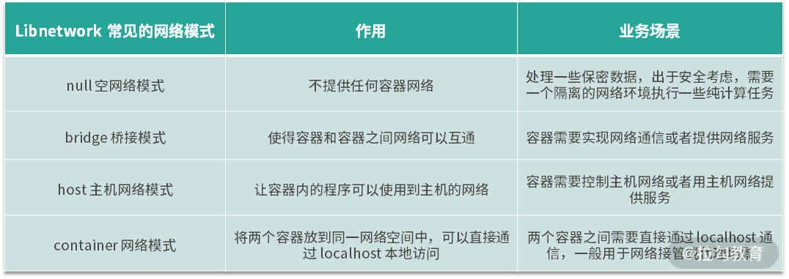

# 容器网络

## 归纳图

  

## 常见网络模式

1. null 空网络模式：可以帮助我们构建一个没有网络接入的容器环境，以保障数据安全。
    - docker run --net=none -it busybox
2. bridge 桥接模式：默认网络模式，可以打通容器与容器间 IP 网络通信的需求。
    - docker run --net=bridge -it busybox
3. host 主机网络模式：可以让容器内的进程共享主机网络，从而监听或修改主机网络
    - docker run -it --net=host busybox
4. container 网络模式：可以将两个容器放在同一个网络命名空间内，让两个业务通过 localhost 即可实现访问。
    - docker run -it --net=container:busybox1 --name=busybox2 busybox sh

## 详解桥接模式

特性：  
1. 容器直接通过容器 IP 访问到另外一个容器
2. 实现主机与容器的互通，我们在容器内启动的业务，可以从主机直接请求
3. Docker 的 bridge 模式由 Linux 的 veth 和 bridge 技术实现
   - veth 是 Linux 中的虚拟设备接口，veth 都是成对出现的，它在容器中，通常充当一个桥梁。veth 可以用来连接虚拟网络设备，例如 veth 可以用来连通两个 Net Namespace，从而使得两个 Net Namespace 之间可以互相访问
   - Linux bridge 是一个虚拟设备，是用来连接网络的设备，相当于物理网络环境中的交换机。Linux bridge 可以用来转发两个 Net Namespace 内的流量
   - Docker 启动时，libnetwork 会在主机上创建 docker0 网桥，docker0 网桥就相当于图 1 中的交换机，而 Docker 创建出的 brige 模式的容器则都会连接 docker0 上，从而实现网络互通
   -   

## 详解主机模式

容器内的网络并不是希望永远跟主机是隔离的，有些基础业务需要创建或更新主机的网络配置，我们的程序必须以主机网络模式运行才能够修改主机网络。有些场景想要使用主机网络，但又不想把运行环境直接安装到主机上的场景中。例如我想在主机上运行一个 busybox 服务，但又不想直接把 busybox 安装到主机上污染主机环境，此时我可以使用以下命令启动一个主机网络模式的 busybox 镜像。  

特性：  
1. 不会为容器创建新的网络配置和 Net Namespace
2. 容器中的进程直接共享主机的网络配置，可以直接使用主机的网络信息，此时，在容器内监听的端口，也将直接占用到主机的端口
3. 除了网络共享主机的网络外，其他的包括进程、文件系统、主机名等都是与主机隔离的

## 详解容器模式

容器网络模式允许一个容器共享另一个容器的网络命名空间。当两个容器需要共享网络，但其他资源仍然需要隔离时就可以使用 container 网络模式，例如我们开发了一个 http 服务，但又想使用 nginx 的一些特性，让 nginx 代理外部的请求然后转发给自己的业务，这时我们使用 container 网络模式将自己开发的服务和 nginx 服务部署到同一个网络命名空间中。  

执行步骤：  
1. docker run -d --name=busybox1 busybox sleep 3600
2. docker run -it --net=container:busybox1 --name=busybox2 busybox sh