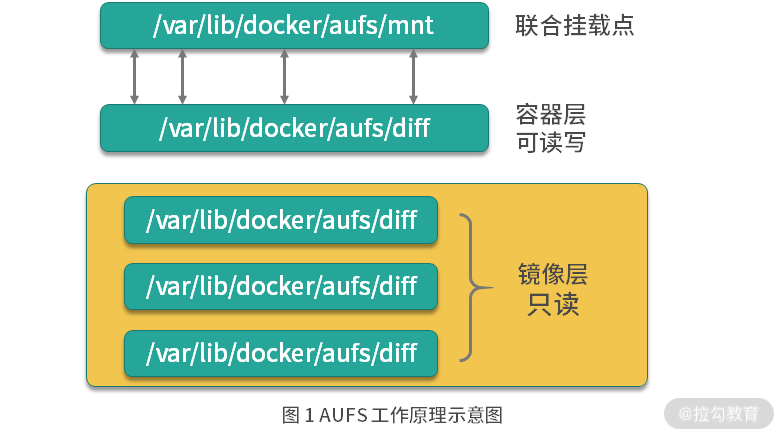

# 联合文件系统

## 作用

Docker 主要是基于 Namespace、cgroups 和联合文件系统这三大核心技术实现的。

联合文件系统（Union File System，Unionfs）是一种分层的轻量级文件系统，它可以把多个目录内容联合挂载到同一目录下，从而形成一个单一的文件系统，这种特性可以让使用者像是使用一个目录一样使用联合文件系统。

那联合文件系统对于 Docker 是一个怎样的存在呢？它可以说是 Docker 镜像和容器的基础，因为它可以使 Docker 可以把镜像做成分层的结构，从而使得镜像的每一层可以被共享。例如两个业务镜像都是基于 CentOS 7 镜像构建的，那么这两个业务镜像在物理机上只需要存储一次 CentOS 7 这个基础镜像即可，从而节省大量存储空间。

说到这儿，你有没有发现，联合文件系统只是一个概念，真正实现联合文件系统才是关键，那如何实现呢？其实实现方案有很多，Docker 中最常用的联合文件系统有三种：AUFS、Devicemapper 和 OverlayFS。OverlayFS 性能最好直接选。

## AUFS

AUFS 是联合文件系统，意味着它在主机上使用多层目录存储，每一个目录在 AUFS 中都叫作分支，而在 Docker 中则称之为层（layer），但最终呈现给用户的则是一个普通单层的文件系统，我们把多层以单一层的方式呈现出来的过程叫作联合挂载。  

  

如图 1 所示，每一个镜像层和容器层都是 /var/lib/docker 下的一个子目录，镜像层和容器层都在 aufs/diff 目录下，每一层的目录名称是镜像或容器的 ID 值，联合挂载点在 aufs/mnt 目录下，mnt 目录是真正的容器工作目录。

## Devicemapper

Devicemapper 是 Linux 内核提供的框架，从 Linux 内核 2.6.9 版本开始引入，Devicemapper 与 AUFS 不同，AUFS 是一种文件系统，而Devicemapper 是一种映射块设备的技术框架。

Devicemapper 提供了一种将物理块设备映射到虚拟块设备的机制，目前 Linux 下比较流行的 LVM （Logical Volume Manager 是 Linux 下对磁盘分区进行管理的一种机制）和软件磁盘阵列（将多个较小的磁盘整合成为一个较大的磁盘设备用于扩大磁盘存储和提供数据可用性）都是基于 Devicemapper 机制实现的。

当 Docker 使用 Devicemapper 作为文件存储驱动时，Docker 将镜像和容器的文件存储在瘦供给池（thinpool）中，并将这些内容挂载在 /var/lib/docker/devicemapper/ 目录下。

## OverlayFS

在 Docker 中 OverlayFS 文件驱动被分为了两种，一种是早期的overlay，不推荐在生产环境中使用，另一种是更新和更稳定的overlay2。Docker 现在默认都是使用 overlay2。

可以使用 docker info 命令看到相关信息：  
```
$ docker info
Client:
 Debug Mode: false
Server:
 Containers: 1
  Running: 0
  Paused: 0
  Stopped: 1
 Images: 1
 Server Version: 19.03.12
 Storage Driver: overlay2
  Backing Filesystem: xfs
  Supports d_type: true
  Native Overlay Diff: true
 Logging Driver: json-file
 Cgroup Driver: cgroupfs
 ... 省略部分无用输出
```

overlay2 和 AUFS 类似，它将所有目录称之为层（layer），overlay2 的目录是镜像和容器分层的基础，而把这些层统一展现到同一的目录下的过程称为联合挂载（union mount）。overlay2 文件系统最多支持 128 个层数叠加，也就是说你的 Dockerfile 最多只能写 128 行，不过这在日常使用中足够了。

下面我们通过拉取一个 Ubuntu 操作系统的镜像来看下 overlay2 是如何存放镜像文件的：  

```
$ docker pull ubuntu:16.04
16.04: Pulling from library/ubuntu
8e097b52bfb8: Pull complete
a613a9b4553c: Pull complete
acc000f01536: Pull complete
73eef93b7466: Pull complete
Digest: sha256:3dd44f7ca10f07f86add9d0dc611998a1641f501833692a2651c96defe8db940
Status: Downloaded newer image for ubuntu:16.04
docker.io/library/ubuntu:16.04
```

可以看到一共拉取了四层 layer，拉取完镜像后我们查看一下 overlay2 的目录：  
```
$ sudo ls -l /var/lib/docker/overlay2/
total 0
drwx------. 3 root root      47 Sep 13 08:16 01946de89606800dac8530e3480b32be9d7c66b493a1cdf558df52d7a1476d4a
drwx------. 4 root root      55 Sep 13 08:16 0849daa41598a333101f6a411755907d182a7fcef780c7f048f15d335b774deb
drwx------. 4 root root      72 Sep 13 08:16 94222a2fa3b2405cb00459285dd0d0ba7e6936d9b693ed18fbb0d08b93dc272f
drwx------. 4 root root      72 Sep 13 08:16 9d392cf38f245d37699bdd7672daaaa76a7d702083694fa8be380087bda5e396
brw-------. 1 root root 253, 17 Sep 13 08:14 backingFsBlockDev
drwx------. 2 root root     142 Sep 13 08:16 l
```

我们可以通过docker image inspect命令来查看某个镜像的层级关系，例如我想查看刚刚下载的 Ubuntu 镜像之间的层级关系，可以使用以下命令：  
```
$ docker image inspect ubuntu:16.04
...省略部分输出
"GraphDriver": {
            "Data": {
                "LowerDir": "/var/lib/docker/overlay2/9d392cf38f245d37699bdd7672daaaa76a7d702083694fa8be380087bda5e396/diff:/var/lib/docker/overlay2/94222a2fa3b2405cb00459285dd0d0ba7e6936d9b693ed18fbb0d08b93dc272f/diff:/var/lib/docker/overlay2/01946de89606800dac8530e3480b32be9d7c66b493a1cdf558df52d7a1476d4a/diff",
                "MergedDir": "/var/lib/docker/overlay2/0849daa41598a333101f6a411755907d182a7fcef780c7f048f15d335b774deb/merged",
                "UpperDir": "/var/lib/docker/overlay2/0849daa41598a333101f6a411755907d182a7fcef780c7f048f15d335b774deb/diff",
                "WorkDir": "/var/lib/docker/overlay2/0849daa41598a333101f6a411755907d182a7fcef780c7f048f15d335b774deb/work"
            },
            "Name": "overlay2"
        },
...省略部分输出
```

从上述的显示中可以看到一个镜像就是这么被构建的。下面我们将镜像运行起来成为容器：  
```
$ docker run --name=ubuntu -d ubuntu:16.04 sleep 3600
$ docker inspect ubuntu
...省略部分输出
 "GraphDriver": {
            "Data": {
                "LowerDir": "/var/lib/docker/overlay2/4753c2aa5bdb20c97cddd6978ee3b1d07ef149e3cc2bbdbd4d11da60685fe9b2-init/diff:/var/lib/docker/overlay2/0849daa41598a333101f6a411755907d182a7fcef780c7f048f15d335b774deb/diff:/var/lib/docker/overlay2/9d392cf38f245d37699bdd7672daaaa76a7d702083694fa8be380087bda5e396/diff:/var/lib/docker/overlay2/94222a2fa3b2405cb00459285dd0d0ba7e6936d9b693ed18fbb0d08b93dc272f/diff:/var/lib/docker/overlay2/01946de89606800dac8530e3480b32be9d7c66b493a1cdf558df52d7a1476d4a/diff",
                "MergedDir": "/var/lib/docker/overlay2/4753c2aa5bdb20c97cddd6978ee3b1d07ef149e3cc2bbdbd4d11da60685fe9b2/merged",
                "UpperDir": "/var/lib/docker/overlay2/4753c2aa5bdb20c97cddd6978ee3b1d07ef149e3cc2bbdbd4d11da60685fe9b2/diff",
                "WorkDir": "/var/lib/docker/overlay2/4753c2aa5bdb20c97cddd6978ee3b1d07ef149e3cc2bbdbd4d11da60685fe9b2/work"
            },
            "Name": "overlay2"
        },
...省略部分输出
```

可以看到 overlay2 目录下增加了容器层相关的目录，我们再来查看一下容器层下的内容：  
```
$ sudo ls -l /var/lib/docker/overlay2/4753c2aa5bdb20c97cddd6978ee3b1d07ef149e3cc2bbdbd4d11da60685fe9b2
total 8
drwxr-xr-x. 2 root root   6 Sep 13 08:47 diff
-rw-r--r--. 1 root root  26 Sep 13 08:47 link
-rw-r--r--. 1 root root 144 Sep 13 08:47 lower
drwxr-xr-x. 1 root root   6 Sep 13 08:47 merged
drwx------. 3 root root  18 Sep 13 08:47 work
```

link 和 lower 文件与镜像层的功能一致，link 文件内容为该容器层的短 ID，lower 文件为该层的所有父层镜像的短 ID 。diff 目录为容器的读写层，容器内修改的文件都会在 diff 中出现，merged 目录为分层文件联合挂载后的结果，也是容器内的工作目录。

